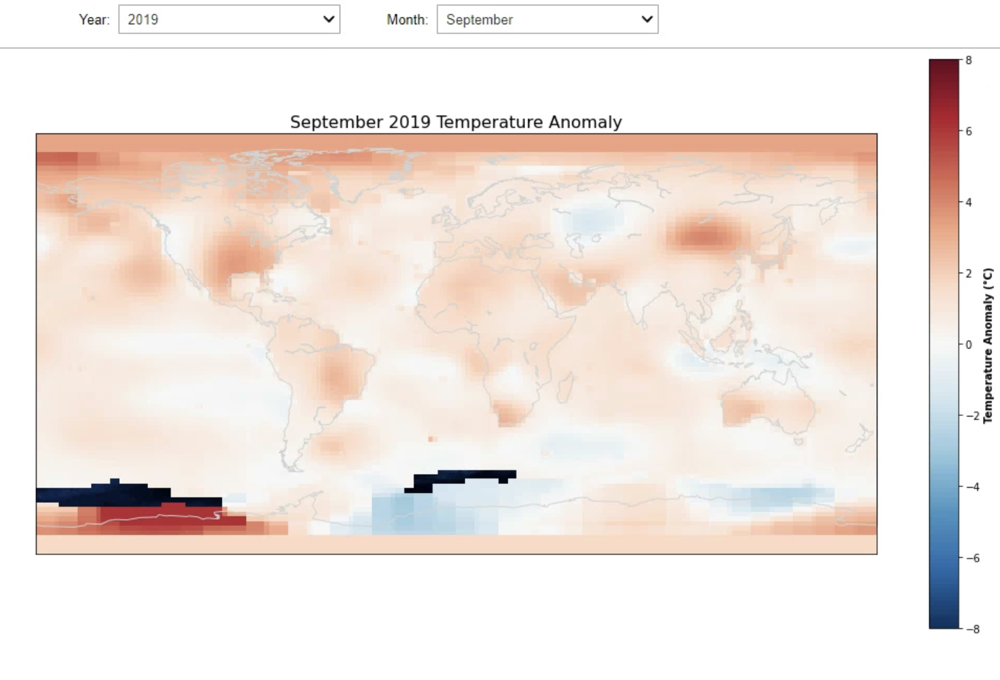
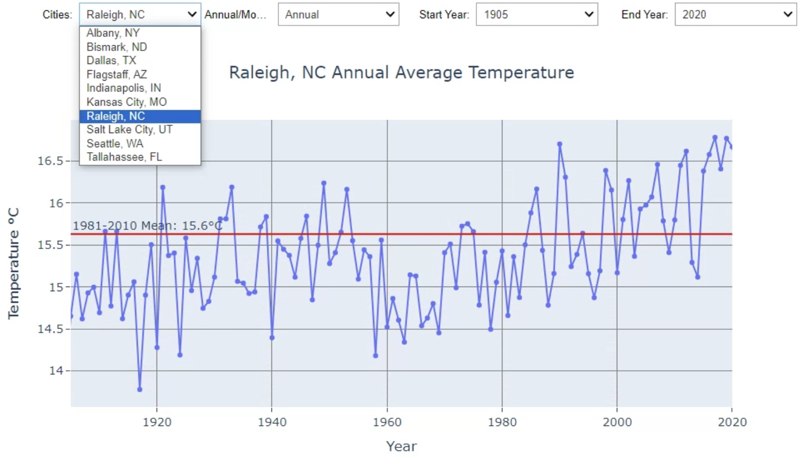

# Climate Visualization Project

Author: Logan McLaurin
 
This software comes unwarranted.

Skills Demonstrated: Data Analysis with Python, Data Visualization, Programming Interactive Widgets, Unit Testing

## Introduction

Climate change has become a central focus of research in the geosciences. Attempts to forecast and interpret such changes can provide insight into how climate change is impacting our planet and many other aspects of human civilization. Even so, considering the climate change that has already occurred based on prior observations is arguably just as important. Analyzing historical data regarding the Earth's temperature and its trends is fundamental to addressing a changing climate's current and future implications.

## Methodology

Average air temperature data is analyzed on global and local scales for the years between 1890 and 2021. Datasets such as those provided by the *National Centers for Environmental Information* and the *NASA Goddard Institute for Space Studies* can be provided monthly average air temperature data to be analyzed. Two visual representations of Earth's temperature will be utilized, corresponding to a map of global average temperature anomalies and timescale plots for select cities showing average temperatures for each year.

### Global Temperature Anomalies Map

The *NASA Goddard Institute* provides the dataset utilized to generate the map of global temperature anomalies for Space Studies*. The surface temperature analysis is based on the *Global Historical Climate Network (NOAA/NCDC) version 4*, which combines data from weather stations to estimate temperature changes over large regions. This dataset, in particular, includes both land and sea surface temperature anomalies based upon a 1200 km resolution with records stretching from 1890-2021. This is represented by a gridded scheme of 2° latitude by 2° longitude zones. The average temperature anomalies for each month during a year are recorded in degrees Celsius relative to the 1951-1980 (month) averages for these zones.
 
 
The file `gistemp1200_GHCNv4_ERSSTv5.nc` located in the local working directory of the project repository contains the temperature anomaly data. This file is loaded into the function `analyze_global_temp_anomalies.py`. No extra processing must be completed following the loading of the dataset by the netcdf4 module (data can be used as is). The function takes in a user-specified year and month for which anomalies are to be visualized. The dataset is sliced based on these times and plotted using the *basemap* module through *matplotlib*. Shaded anamolies are created using *pcolormesh* which visually represent the 2 by 2 degree zones described with corresponding latitudes and longitudes.

### Temperature Timeseries Plots for Cities

The *North American Dataset* is utilized to generate average temperature time series for select cities and is provided by the *National Centers for Environmental Information*. This dataset includes files for thousands of Cooperative Observer stations which include ASOS stations and other local weather stations across the Continental United States. 
 
 
The file `load_city_climate_files.py` includes functions to pull and parse through specific city files. The software currently has the capacity to pull 10 different stations matching the city name (city, ST) to the station's individual Cooperative Observer Identification Number. This dictionary can be expanded in future updates to include more cities. Once the files are pulled by filename, the file information must be parsed and modified to remove special observational flags and correct the measurement scale (to reflect degrees Celsius to the hundredths place) so that the station information can be passed to a data frame via the *pandas* module.
 
 
The file `analyze_city_climate_data.py` incorporates the processes described above so that average temperature data for a certain time frame and timescale can be visualized on a timescale. The user specifies the particular location, timescale (the averages for a particular month or the annual averages), and a start year and end year for the time series. Annual averages are calculated by averaging the monthly averages for each year. The average temperature for the location's climatology is also calculated based on the 1981-2010 temperatures corresponding to the same user inputs. This provides a reference point for the time series data and a perspective on the "normal" averages for the location unique to the time series. The *plotly* module is imported to create this time series plot based on the temperature averages and the corresponding years. *plotly* is favored over *matplotlib* in this instance so as to promote an interactive plotting experience for the user. Datatips are included for the scatter of temperature averages for the time series plot, and this plot can easily be modified within the figure relative to Jupyter Widgets (matplotlib does not work well with Jupyter widgets).

## Implementation

These visualizations can be paired with Jupyter widgets to enhance the user experience and optimize the functionality of this software. The Jupyter widgets used include dropdown menus that incorporate all of the main inputs described for analyzing both visualizations above. The functions for the City Climate Timeseries and the Global Anomalies (respectively) included in `Interactive_Climate_Visualization.py` allow the implementation of these widgets for each process. The widgets are coded to automatically update the map and time series upon changing any dropdown values. This promotes easy access to this software so that multiple different combinations of inputs can be tested quickly and efficiently without any headaches for the user.
 
The Jupyter Notebook `Climate_Visualization_Report.ipynb` can be used to plot the Global Temperature Anomalies Map and the Temperature Timeseries Plots for Cities. The user MUST run both cells for the dropdown menus to generate. These are not self-containing cells, with the exception of the map. Please feel free to experiment with the software in this jupyter notebook further. Two examples of the generated products for both the global analyses and the city plots are included below:

## Results and Testing

After reviewing both visualizations, there appears to be evidence of a warming climate across most of the observed globe and the cities. As far as the global temperature anomalies are concerned, as time advances closer to the present, a greater amount of area exhibits positive average temperature anomalies for each month. Most cities also appear to have a positive trend when observing the times series for most months. This project represents how data visualization can support a broader understanding of a field of research, particularly regarding climate change.

### Testing

The strategies taken regarding testing the software's functions relate to ensuring data was loaded correctly, and comparing numeric results from the plotting to the expected or cross-referenced results. Testing is extensively covered as a part of the Python functions listed and described above. It is, however, rather difficult to quantitatively test the functions of the plotting software directly as there is not a set, desired output that the plotting functions or the widgets can be tested against. However, extensively testing the data provided to these plotting processes ensures that what is being plotted is reliable data. The visualizations themselves can be "tested" simply by observing whether or not the visualizations make sense without any extreme outliers. Averages and elements plotted in the graphs and anomaly map have been cross-examined with other values for specific locations and general regions provided by NASA and the NCDC. The purpose of these visualizations is to let the data and results speak to the user directly.
